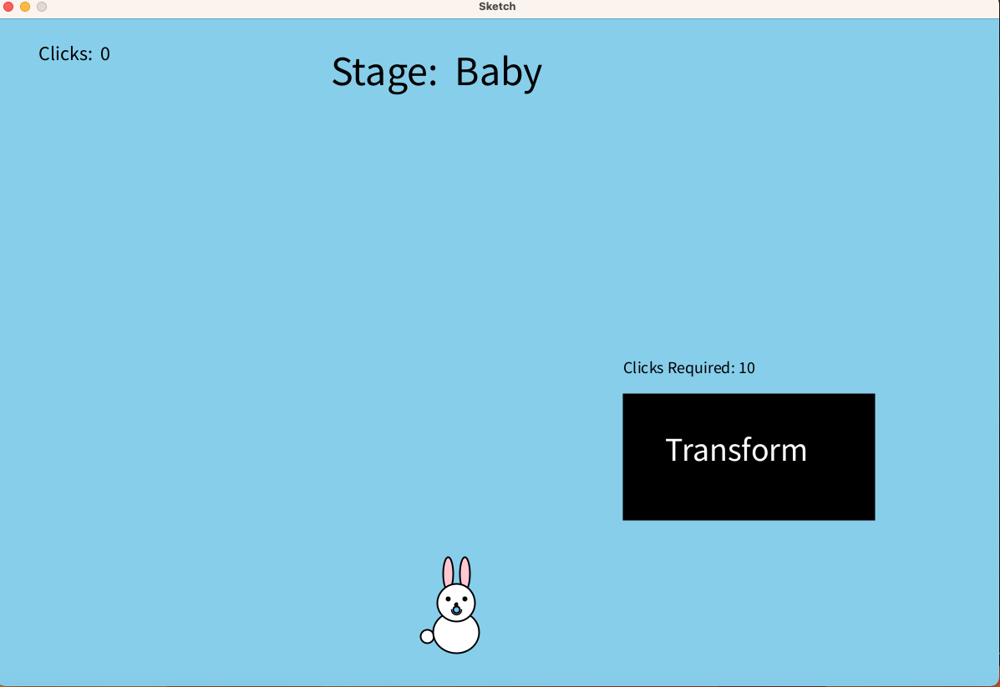

# ICS3U CPT – Interactive Processing Project

This repository contains your ICS3U Culminating Performance Task (CPT).

### Start here:
Please read the full project instructions in **[INSTRUCTIONS.md](INSTRUCTIONS.md)**.

Assessment criteria for this project are described in **[ASSESSMENT.md](ASSESSMENT.md)**.

Once you are ready to submit, replace the contents of this README.md file with:

# ICS3U1 - COMPUTER SCIENCE CPT

**Description**
- This program is a Bunny Growth Simulator that consists of different life stages (Baby, Child, Puberty, Teen, Adult), 

**User Interaction**

 - This program is based off of clicks and the requried clicks, for the bunny to be able to grow and evolve into a different stages of life. Any key that is pressed will change the colour of the bunny.

**Incomplete Features**
- Some incomplete features was getting the bunny to jump

**Limitations**
- Canvas Resizing is a limitation where it affects text placement, bunny placement, change mouse boundaries in the transform button and more

**External Assets**
- All original artwork created by Kaiden Chan

